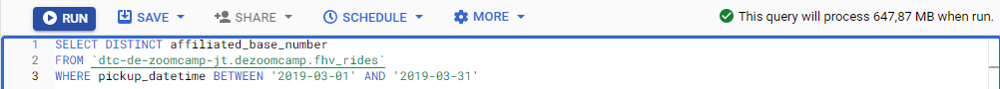

## Week 3 Homework

Quick Reference:
- [Environment Setup](https://github.com/jeantozzi/data-engineering-zoomcamp-2023/tree/main/week_3#environment-setup)
- [Question 1](https://github.com/jeantozzi/data-engineering-zoomcamp-2023/tree/main/week_3#question-1)
- [Question 2](https://github.com/jeantozzi/data-engineering-zoomcamp-2023/tree/main/week_3#question-2)
- [Question 3](https://github.com/jeantozzi/data-engineering-zoomcamp-2023/tree/main/week_3#question-3)
- [Question 4](https://github.com/jeantozzi/data-engineering-zoomcamp-2023/tree/main/week_3#question-4)
- [Question 5](https://github.com/jeantozzi/data-engineering-zoomcamp-2023/tree/main/week_3#question-5)
- [Question 6](https://github.com/jeantozzi/data-engineering-zoomcamp-2023/tree/main/week_3#question-6)
- [Question 7](https://github.com/jeantozzi/data-engineering-zoomcamp-2023/tree/main/week_3#question-7)
- [(Not required) Question 8](https://github.com/jeantozzi/data-engineering-zoomcamp-2023/tree/main/week_3#not-required-question-8)


## Environment Setup
### Important Note
You can load the data however you would like, but keep the files in .GZ Format.<br>
If you are using orchestration such as Airflow or Prefect do not load the data into Big Query using the orchestrator.<br>
Stop with loading the files into a bucket.<br>
You can use the CSV option for the GZ files when creating an External Table.

### Setup
Create an external table using the fhv 2019 data. <br>
Create a table in BQ using the fhv 2019 data (do not partition or cluster this table).<br>
Data can be found here: https://github.com/DataTalksClub/nyc-tlc-data/releases/tag/fhv

### Virtual Environment and dependencies
Like we did in [week_2](https://github.com/jeantozzi/data-engineering-zoomcamp-2023/tree/main/week_2), we'll be using a virtual environment, Prefect and GCS Block.

So let's run the following commands:

```bash
# Creating, activating and setting up an Anaconda Virtual Environment
conda create -n zoomcamp-de-week-3 python=3.9 -y
conda activate zoomcamp-de-week-3
pip install -r requirements.txt

# Creating GCS block
python blocks/make_gcp_blocks.py
```

### Prefect
For Prefect, run the commands below:

```bash
# Building, applying and running a Prefect deployment
prefect deployment build flows/github_to_gcs.py:github_to_gcs -n github_to_gcs -q default --apply
prefect deployment run github-to-gcs/github_to_gcs -p year=2019 -p months=[1,2,3,4,5,6,7,8,9,10,11,12]

# Prefect worker
prefect agent start -q default

# Prefect Web UI (in another terminal)
prefect orion start
```

You can check the flow file [here](./flows/github_to_gcs.py).

Checking the GCS bucket, we have all the files there:


### Creating External Table

On BigQuery SQL workspace, let's run the follow query so we can create the external table:

```sql
CREATE OR REPLACE EXTERNAL TABLE `dtc-de-zoomcamp-jt.dezoomcamp.fhv_rides_external`
OPTIONS (
  format = 'CSV',
  uris = ['gs://de_zoomcamp_taxi_trips/data/fhv/fhv_tripdata_2019-*.csv.gz']
);
```

### Creating BQ Table

As for the BigQuery Table, we'll proceed with **ADD DATA > Source: Google Cloud Storage**, and then do as the image below:


Now we can continue! :D

## Question 1:
What is the count for fhv vehicle records for year 2019?
- 65,623,481
- 43,244,696
- 22,978,333
- 13,942,414

### Solution

For this, let's simply the following query: 

```sql
SELECT COUNT(*)
FROM `dtc-de-zoomcamp-jt.dezoomcamp.fhv_rides`
```

Output:


Answer: `43,244,696`

## Question 2:
Write a query to count the distinct number of affiliated_base_number for the entire dataset on both the tables.</br> 
What is the estimated amount of data that will be read when this query is executed on the External Table and the Table?

- 25.2 MB for the External Table and 100.87MB for the BQ Table
- 225.82 MB for the External Table and 47.60MB for the BQ Table
- 0 MB for the External Table and 0MB for the BQ Table
- 0 MB for the External Table and 317.94MB for the BQ Table 

### Solution

For External Tables, GCS can't make a preview on estimated amount of data for queries, just like the image below shows:


For BigQuery Tables, it is possible, as we can see here:


Answer: `0 MB for the External Table and 317.94MB for the BQ Table`

## Question 3:
How many records have both a blank (null) PUlocationID and DOlocationID in the entire dataset?
- 717,748
- 1,215,687
- 5
- 20,332

### Solution

For this, let's simply the following query: 

```sql
SELECT COUNT(*)
FROM `dtc-de-zoomcamp-jt.dezoomcamp.fhv_rides`
WHERE PUlocationID IS NULL
    AND DOlocationID IS NULL
```

Output:


Answer: `717,748`

## Question 4:
What is the best strategy to optimize the table if query always filter by pickup_datetime and order by affiliated_base_number?
- Cluster on pickup_datetime Cluster on affiliated_base_number
- Partition by pickup_datetime Cluster on affiliated_base_number
- Partition by pickup_datetime Partition by affiliated_base_number
- Partition by affiliated_base_number Cluster on pickup_datetime

### Solution

Partitioning is a way to divide a table into smaller parts based on a column type (increasing int, timestamp etc.), just like the example below:


Clustering is a way to organize the data within a table based on the values in specific columns, so that rows with similar values in the clustered columns are stored physically close to each other, just like the example below:


Hence, we'd want to partition by the column we filter and cluster by the columns we order by.

Answer: `Partition by pickup_datetime Cluster on affiliated_base_number`

## Question 5:
Implement the optimized solution you chose for question 4. Write a query to retrieve the distinct affiliated_base_number between pickup_datetime 2019/03/01 and 2019/03/31 (inclusive).</br> 
Use the BQ table you created earlier in your from clause and note the estimated bytes. Now change the table in the from clause to the partitioned table you created for question 4 and note the estimated bytes processed. What are these values? Choose the answer which most closely matches.
- 12.82 MB for non-partitioned table and 647.87 MB for the partitioned table
- 647.87 MB for non-partitioned table and 23.06 MB for the partitioned table
- 582.63 MB for non-partitioned table and 0 MB for the partitioned table
- 646.25 MB for non-partitioned table and 646.25 MB for the partitioned table

### Solution

Let's create a optmized (Partition + Cluster) table based on the BQ Table with the following query:

```sql
CREATE OR REPLACE TABLE `dtc-de-zoomcamp-jt.dezoomcamp.fhv_rides_optimized`
PARTITION BY DATE(pickup_datetime)
CLUSTER BY affiliated_base_number AS
SELECT * FROM `dtc-de-zoomcamp-jt.dezoomcamp.fhv_rides`;
```

Next, we'll check the estimated bytes processed for both tables:

**fhv_rides**
```sql
SELECT DISTINCT affiliated_base_number
FROM `dtc-de-zoomcamp-jt.dezoomcamp.fhv_rides`
WHERE pickup_datetime BETWEEN '2019-03-01' AND '2019-03-31'
```


**fhv_rides_optimized**
```sql
SELECT DISTINCT affiliated_base_number
FROM `dtc-de-zoomcamp-jt.dezoomcamp.fhv_rides_optimized`
WHERE pickup_datetime BETWEEN '2019-03-01' AND '2019-03-31'
```


Answer: `647.87 MB for non-partitioned table and 23.06 MB for the partitioned table`

## Question 6: 
Where is the data stored in the External Table you created?

- Big Query
- GCP Bucket
- Container Registry
- Big Table

### Solution

We've uploaded the files to GCS, it can also be called GCP Bucket.

Answer: `GCP Bucket`

## Question 7:
It is best practice in Big Query to always cluster your data:
- True
- False

### Solution

Clustering improves filtering and aggregation queries and typically doesn't show much improvement for tables with less than 1 GB of data, and can even increase the metadata. Hence, we shouldn't always cluster our data.

Answer: `False`


## (Not required) Question 8:
A better format to store these files may be parquet. Create a data pipeline to download the gzip files and convert them into parquet. Upload the files to your GCP Bucket and create an External and BQ Table. 

Note: Column types for all files used in an External Table must have the same datatype. While an External Table may be created and shown in the side panel in Big Query, this will need to be validated by running a count query on the External Table to check if any errors occur. 

### Solution

For this question, we'll have to create a new flow for Prefect.<br>
You can check the file [here](./flows/github_parquet_to_csv.py).

Let's run build, apply and run the Prefect deployment with the following commands:

```bash
# Building, applying and running a Prefect deployment
prefect deployment build flows/github_parquet_to_gcs.py:github_parquet_to_gcs -n github_parquet_to_gcs -q default --apply
prefect deployment run github-parquet-to-gcs/github_parquet_to_gcs -p year=2019 -p months=[1,2,3,4,5,6,7,8,9,10,11,12]
```

The output shows that we made it:


As for the tables, we can proceed just like the steps listed in [Environment Setup](https://github.com/jeantozzi/data-engineering-zoomcamp-2023/tree/main/week_3#environment-setup), changing the data source correspondingly.