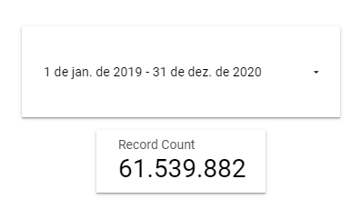
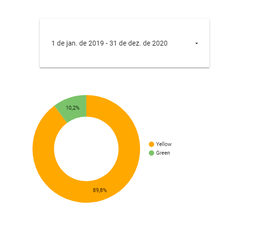
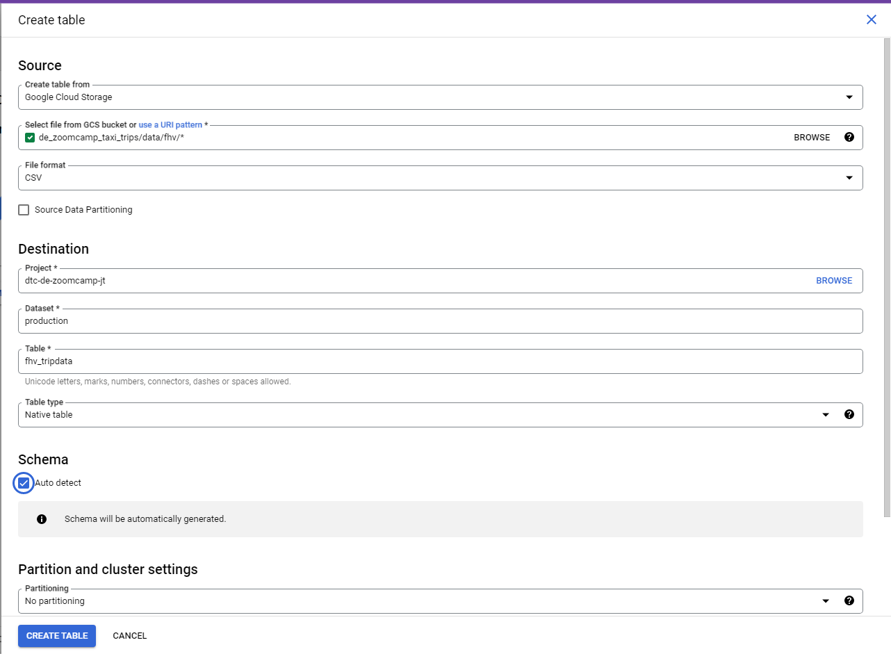
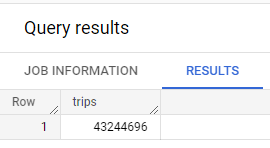
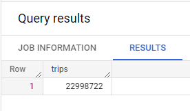
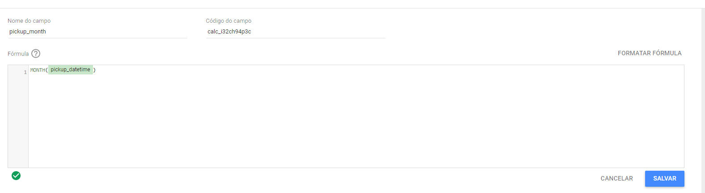
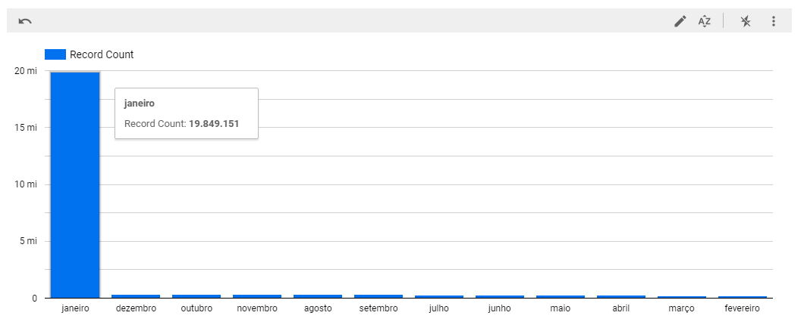

## Week 4 Homework 

Quick Reference:
- General directions
- Question 1
- Question 2 
- Question 3
- Question 4
- Question 5 

## General directions
In this homework, we'll use the models developed during the week 4 videos and enhance the already presented dbt project using the already loaded Taxi data for fhv vehicles for year 2019 in our DWH.

This means that in this homework we use the following data [Datasets list](https://github.com/DataTalksClub/nyc-tlc-data/)
* Yellow taxi data - Years 2019 and 2020
* Green taxi data - Years 2019 and 2020 
* fhv data - Year 2019. 

We will use the data loaded for:

* Building a source table: `stg_fhv_tripdata`
* Building a fact table: `fact_fhv_trips`
* Create a dashboard

> **Note**: if your answer doesn't match exactly, select the closest option 

## Question 1: 

**What is the count of records in the model fact_trips after running all models with the test run variable disabled and filtering for 2019 and 2020 data only (pickup datetime)?** 

You'll need to have completed the ["Build the first dbt models"](https://www.youtube.com/watch?v=UVI30Vxzd6c) video and have been able to run the models via the CLI. 
You should find the views and models for querying in your DWH.

- 41648442
- 51648442
- 61648442
- 71648442

### Solution

For this question, we'll be using the dbt deployment we built following [week 4 unit](https://github.com/DataTalksClub/data-engineering-zoomcamp/tree/main/week_4_analytics_engineering), as well as a Google Looker dashboard connecting to it.

Using the `pickup_datetime` as the date range dimension, this is the output we get:



Answer: `61648442` (the closest option)

## Question 2: 

**What is the distribution between service type filtering by years 2019 and 2020 data as done in the videos?**

You will need to complete "Visualising the data" videos, either using [google data studio](https://www.youtube.com/watch?v=39nLTs74A3E) or [metabase](https://www.youtube.com/watch?v=BnLkrA7a6gM). 

- 89.9/10.1
- 94/6
- 76.3/23.7
- 99.1/0.9

### Solution

Creating a chart using `service_type` as the dimension, we get this:



Answer: `89.9/10.1` (the closest option)

## Question 3: 

**What is the count of records in the model stg_fhv_tripdata after running all models with the test run variable disabled (:false)?**  

Create a staging model for the fhv data for 2019 and do not add a deduplication step. Run it via the CLI without limits (is_test_run: false).
Filter records with pickup time in year 2019.

- 33244696
- 43244696
- 53244696
- 63244696

### Solution

Since we'll be using `fhv` data from now on, it's required to create a BigQuery table as follows:



After that, `stg_fhv_tripdata` must be created in dbt, using this [model]().

With the BigQuery view created, we can query for the result:

```sql
SELECT COUNT(1) AS trips
FROM `dtc-de-zoomcamp-jt.production.stg_fhv_tripdata`
WHERE EXTRACT(YEAR FROM pickup_datetime) = 2019
```

Output:



Answer: `43244696`

## Question 4: 

**What is the count of records in the model fact_fhv_trips after running all dependencies with the test run variable disabled (:false)?**  

Create a core model for the stg_fhv_tripdata joining with dim_zones.
Similar to what we've done in fact_trips, keep only records with known pickup and dropoff locations entries for pickup and dropoff locations. 
Run it via the CLI without limits (is_test_run: false) and filter records with pickup time in year 2019.

- 12998722
- 22998722
- 32998722
- 42998722

### Solution

We'll create the `fact_fhv_trips` BigQuery table using [this model]().

With the BigQuery table created, we can query for the result:

```sql
SELECT COUNT(*) AS trips
FROM `dtc-de-zoomcamp-jt.production.fact_fhv_trips`
WHERE EXTRACT(YEAR FROM pickup_datetime) = 2019
```

Output:



Answer: `22998722`

## Question 5: 

**What is the month with the biggest amount of rides after building a tile for the fact_fhv_trips table?**

Create a dashboard with some tiles that you find interesting to explore the data. One tile should show the amount of trips per month, as done in the videos for fact_trips, based on the fact_fhv_trips table.

- March
- April
- January
- December

### Solution
Using `fact_fhv_trips` connection in Google Looker dashboard, we can create a field named `pickup_month` as plot a chart with it, following the steps below:





Answer: `January`